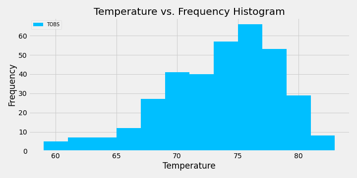
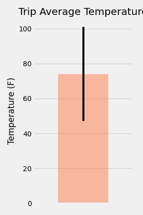
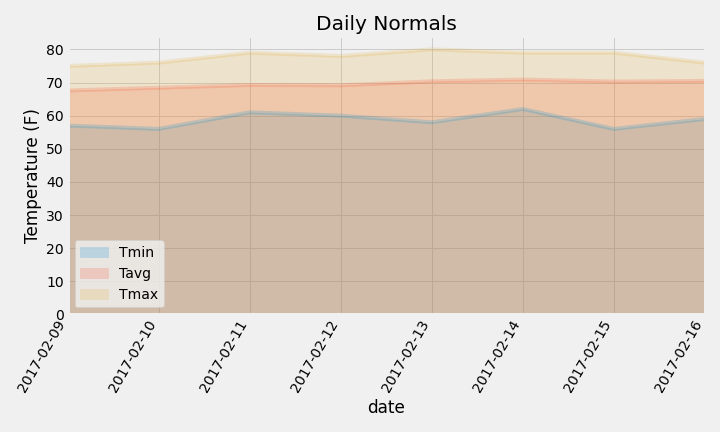

# Surfs-Up

## Climate Analysis and Exploration
Python and SQLAlchemy are used to do basic climate analysis and data exploration of the climate database. All of the following analysis are completed using SQLAlchemy ORM queries, Pandas, and Matplotlib:
* Use the provided [hawaii.sqlite](Resources/hawaii.sqlite) file to complete your climate analysis and data exploration.

* Choose a start date and end date for your trip. Make sure that your vacation range is approximately 3-15 days total.

* Use SQLAlchemy `create_engine` to connect to your sqlite database.

* Use SQLAlchemy `automap_base()` to reflect your tables into classes and save a reference to those classes called `Station` and `Measurement`.

### Precipitation Analysis
* Design a query to retrieve the last 12 months of precipitation data.

* Select only the `date` and `prcp` values.

* Load the query results into a Pandas DataFrame and set the index to the date column.

* Sort the DataFrame values by `date`.

* Plot the results using the DataFrame `plot` method.

  .png)

* Use Pandas to print the summary statistics for the precipitation data.

### Station Analysis
* Design a query to calculate the total number of stations.

* Design a query to find the most active stations.

  * List the stations and observation counts in descending order.

  * Which station has the highest number of observations?

  * Hint: You may need to use functions such as `func.min`, `func.max`, `func.avg`, and `func.count` in your queries.

* Design a query to retrieve the last 12 months of temperature observation data (TOBS).

  * Filter by the station with the highest number of observations.

  * Plot the results as a histogram with `bins=12`.

    

### Temperature Analysis 
* Use the `calc_temps` function to calculate the min, avg, and max temperatures for your trip using the matching dates from the previous year (i.e., use "2017-01-01" if the chosen trip start date was "2018-01-01").

* Plot the min, avg, and max temperature from your previous query as a bar chart.

  * Use the average temperature as the bar height.

  * Use the peak-to-peak (TMAX-TMIN) value as the y error bar (YERR).

    
    
### Daily Rainfall Average

* Calculate the rainfall per weather station using the previous year's matching dates.

* Calculate the daily normals (averages for the min, avg, and max temperatures)

* Use a function called `daily_normals` to calculate the daily normals for a specific date. This date string is in the format `%m-%d`. Use all historic TOBS that match the date string.

* Create a list of dates for a trip in the format `%m-%d`. Use the `daily_normals` function to calculate the normals for each date string and append the results to a list.

* Load the list of daily normals into a Pandas DataFrame and set the index equal to the date.

* Use Pandas to plot an area plot (`stacked=False`) for the daily normals.

  

## Climate App
* File: [app.py](app.py)
* Flask is used to create routes.

### Routes

* `/`

  * Home page.

  * All routes that are available are listed.

* `/api/v1.0/precipitation`

  * The query results are converted to a dictionary using `date` as the key and `prcp` as the value.

  * The JSON representation of the dictionary is returned.

* `/api/v1.0/stations`

  * A JSON list of stations from the dataset is returned.

* `/api/v1.0/tobs`
  * Query the dates and temperature observations of the most active station for the last year of data.
  
  * A JSON list of temperature observations (TOBS) for the previous year is returned.

* `/api/v1.0/<start>` and `/api/v1.0/<start>/<end>`

  * Return a JSON list of the minimum temperature, the average temperature, and the max temperature for a given start or start-end range.

  * When given the start only, calculate `TMIN`, `TAVG`, and `TMAX` for all dates greater than and equal to the start date.

  * When given the start and the end date, calculate the `TMIN`, `TAVG`, and `TMAX` for dates between the start and end date inclusive.

### Other Considerations

* The station and measurement tables are joined for some of the queries.

* Flask `jsonify` is used to convert your API data into a valid JSON response object.

